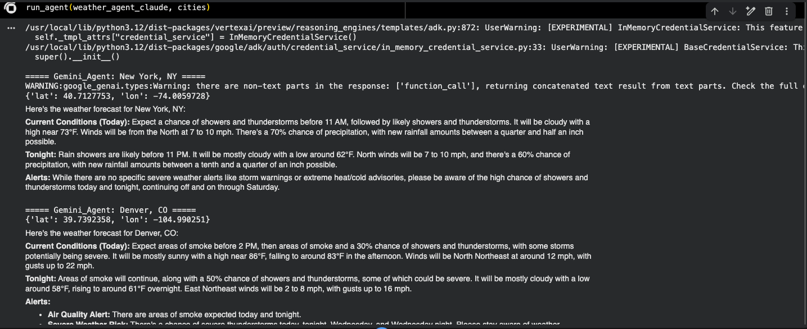

# Challenge 1 - Single Weather Agent

A single ADK agent that answers weather questions using two custom Python tools:
geocoding (city to latitude/longitude) and a US National Weather Service forecast
lookup. The agent grounds every answer in live forecast data rather than model
recall.

[Back to the main README](../../readme.md)

## Screenshots

### Weather agent answering multiple cities

Output of `run_agent(weather_agent, cities)` for New York, NY and Denver, CO. For
each city the agent resolves coordinates, calls the forecast tool, and returns
grounded **Current Conditions**, **Tonight**, and **Alerts** sections - including a
live Air Quality (smoke) alert for Denver. This establishes the baseline pattern of
an agent equipped with custom tools and grounded in external data.
