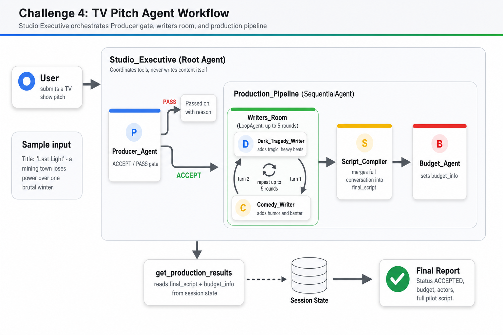
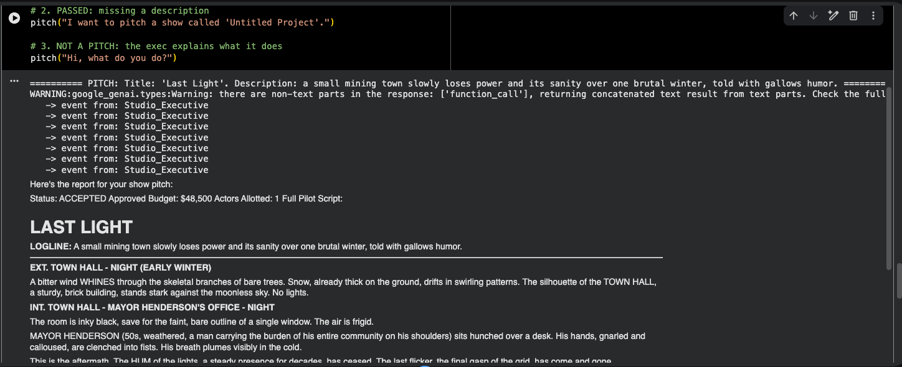

# Challenge 4 - Multi-Agent Production Pipeline

Orchestrates multiple specialized agents into a sequential production pipeline
coordinated by a root agent. This is the first of the two **solution architecture**
diagrams in this lab series.

[Back to the main README](../../readme.md)

## Solution architecture

### TV Pitch Agent Workflow

The `Studio_Executive` root agent coordinates tools but never writes content
itself. A `Producer_Agent` acts as an ACCEPT/PASS gate on the incoming pitch.
Accepted pitches flow into a `Production_Pipeline` (`SequentialAgent`):

1. **Writers_Room** - a `LoopAgent` (up to 5 rounds) in which the
   `Dark_Tragedy_Writer` and `Comedy_Writer` iteratively build the script.
2. **Script_Compiler** - merges the full conversation into a final script.
3. **Budget_Agent** - sets the budget information.

Results (`final_script` + `budget_info`) are read back from shared **session
state** by `get_production_results` to assemble the final report. The diagram shows
the core orchestration concepts: a root coordinator, a gating sub-agent, a loop
agent, a sequential pipeline, and shared session state.

## Screenshots

### Pipeline run output

A live run of the pipeline. The `Producer_Agent` gate correctly **passes** a pitch
missing a description and rejects a non-pitch ("Hi, what do you do?"), while a valid
pitch ("Last Light") flows through the full `Studio_Executive` pipeline. The final
report reads from session state: **Status ACCEPTED**, an approved budget of $48,500,
1 actor allotted, and a complete pilot script (logline plus scene-by-scene
screenplay) produced by the writers-room loop.
