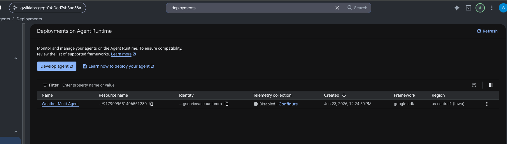

# Challenge 5 - Deploying a Multi-Agent System

Deploys the Challenge 3 multi-agent weather system to Agent Platform via
`agent_engines.create()`. The agent logic lives in the importable `weather_agent/`
package so it can be tested locally and deployed without cloudpickle fragility.

[Back to the main README](../../readme.md)

## Screenshots

### Deployed agent on Agent Runtime

The Google Cloud console **Deployments on Agent Runtime** view confirms the
`Weather Multi-Agent` is live: deployed with the `google-adk` framework in the
`us-central1` (Iowa) region, with its resource name and service-account identity
listed. This is the move from notebook-local execution to a managed, hosted agent.
